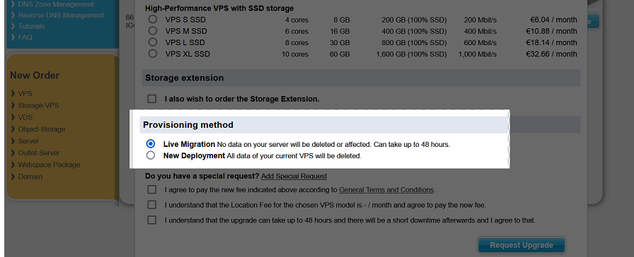

# Gain additional performance / New Datacenter
### Upgrade with Live Migation

In some cases, when upgrading your VPS or VDS, the 'Live Migration' option is sadly not possible. This is generally due to the differences between the host systems.

> You may see one such example here, where the **Live Migration** *is* possible.

  
**Note:** *[CCP](https://my.contabo.com/) screenshot taken during VPS SSD upgrade process.*

---

Wether it is because of this underlying difference, or you wish to choose a re-deployment of your VPS, we generally recommend to use **Clonezilla**, which allows you to create a complete backup of your partitions: 

https://clonezilla.org 

This live system can be started in the [Customer Control Panel](https://my.contabo.com) - under the 'VPS control' tab by clicking on the floppy disk icon. From the list of rescue systems you can then select there 'Clonezilla Live'. After the upgrade is completed, you may then upload your data onto the new machine. 

## Want a Different / New Datacenter?
There are some cases, where it would be thinkable and very efficient for your virtual server to be in a different one of our DC. Our Customer Support doesn't offer a test server or a test download-file, where you could test the latency difference. Feel free, however, to use the following IP addresses to test via ping or traceroute:

* 5.189.188.153 (European Union, Germany)
* 209.126.15.91 (United States, Missouri)
* 209.126.79.91 (United States, New York City)
* 209.126.70.91 (United States, Seattle)
* 103.164.55.91 (Asia, Singapore)  

If you determine a location with better or best latency, you may open a ticket with our Customer Support and state which one. We can than provide you with an offer an details on changing the location of your VPS.
#### The possibilities

1. Live Migration *between DataCenters*
2. Full immediate Reinstallation (with data-loss)
3. Cancellation of current VPS *at the end of current Billing Period*

https://contabo.com/en/location-fees/

You can use your server during the whole Migration process. After the completion of data transfer, the server needs to be rebooted. This causes a downtime, during which we may reconfigure the main IP address of your server.

You are welcome at any time.
